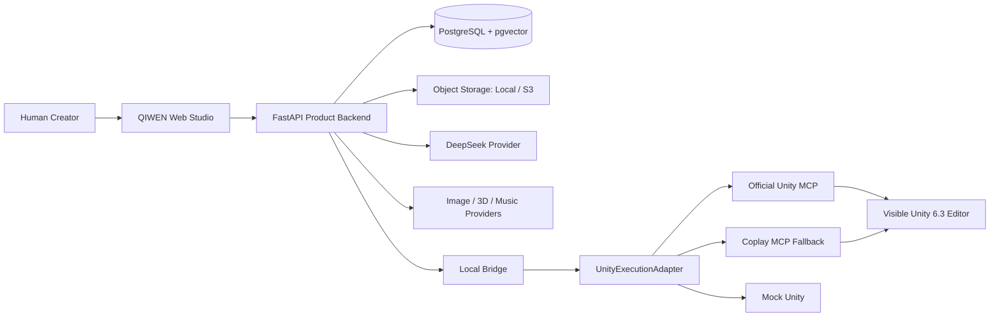
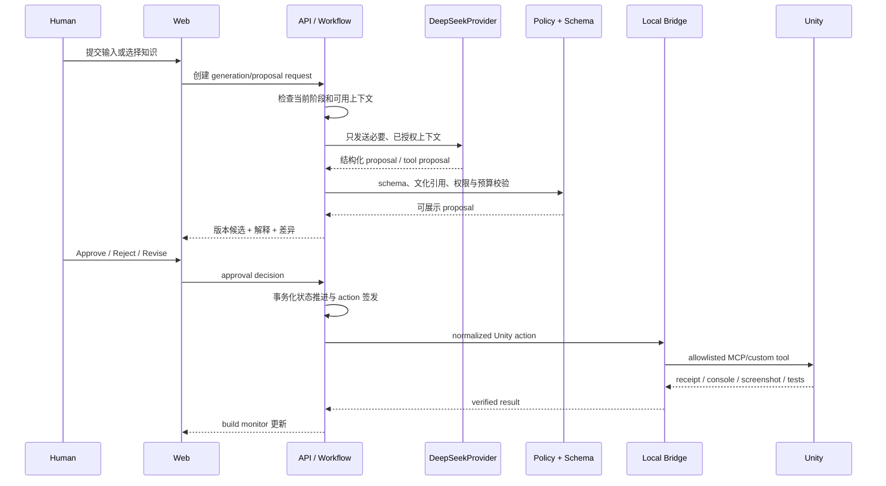

# 《漆问》PHASE 0 — ARCHITECTURE

> 本架构执行 `QIWEN《漆问》.md`，不替代 MASTER SPEC。PHASE 0 只确定边界、契约和验证顺序，不进入 MILESTONE 1 编码。

## 1. 架构目标

《漆问》是一个 desktop-first Web 创作工作室：用户从经过策展的漆文化知识出发，与单一可见的 Co-Creator 共同完成概念、视觉、3D、音乐、玩法逻辑、Unity 构建和 Playtest。系统价值不是“一句话自动出游戏”，而是让人持续选择、体验、修改、批准和接管。

架构必须同时保证：

1. MASTER SPEC 的阶段顺序和 Approval Gate 不能被模型、前端或 Unity 插件绕过。
2. 文化知识、创作选择、生成资产、Unity 产物均可引用、追溯、版本化和回滚。
3. 没有任何真实 Provider key 或 Unity 环境时，产品仍能以 Demo Generation Mode 完整演示。
4. Unity Editor 始终可见，自动化有进度、日志、错误和人工接管入口。
5. Unity MCP、DeepSeek 和生成供应商可替换，不污染产品域模型。

## 2. 系统上下文



关键控制关系：Human 对阶段性创意和构建动作给出批准；Backend 是唯一 workflow authority；Co-Creator/DeepSeek 只能提出方案；Local Bridge 只执行后端签发且未过期的窄命令；Unity 不直接连接真实 AI Provider。

## 3. 组件边界

### 3.1 `apps/web`

Next.js/React 的工作室 UI，负责：

- 项目首页、阶段导航、画布/卡片/对话、知识探索、版本比较与 Approval UI。
- 图片、GLB 与音频预览；Unity build monitor、Console 摘要和 Playtest 反馈表。
- 只通过 Backend API/SSE/WebSocket 读取与提交状态，不直接访问 DeepSeek、生成 Provider 或 Local Bridge。
- UI 中只有一个 Co-Creator；内部模块或未来子任务不会被包装成一排“Agent 人格”。

### 3.2 `apps/api`

FastAPI 是产品控制平面：

- Auth/session、Project、curated Knowledge、Artifact、Version、Approval、Workflow State。
- Agent Orchestrator：组装上下文、调用 LLMProvider、验证结构输出、形成 proposal，不执行越权副作用。
- Provider Job Orchestrator：图片/3D/音乐异步提交、轮询/回调、下载、校验、资产登记。
- Unity Build Orchestrator：把已批准版本编译成结构化 `UnityBuildPlan`，签发 Bridge actions，限制自动修复次数。
- Audit/Event：每一次提议、批准、状态改变、Provider 调用与 Unity action 都可查询。

### 3.3 `apps/local-bridge`

独立 Node.js/TypeScript 本地进程，负责 OS 与 Unity 边界：

- 探测 Unity CLI/Hub/Editor、安装版本、当前进程和项目路径。
- 作为 MCP client 管理官方 relay stdio；在回退模式管理 Coplay server/bridge。
- 将不同 MCP 的工具映射为稳定的 QIWEN commands；不把供应商原始 tool list 原样转发给 LLM。
- 维护 action queue、timeout/cancel、domain reload/compile 等待、heartbeat 与多实例精确绑定。
- 上传 Console、测试、截图、构建结果和 action receipt；不持有 DeepSeek 或生成 Provider key。

### 3.4 `unity/QIWEN.Unity`

Unity 6.3 LTS 可见工程及受控 Editor package：

- 固定模板、场景根节点、材质/音频/交互脚本基类、测试、构建 profile。
- QIWEN custom MCP tools：只接收稳定 schema，执行导入批准资产、实例化模板、应用 Gameplay Spec、读取状态、截图、测试和构建。
- 生成代码和导入资产放入明确的 generated area；手写模板和用户资产不被任意覆盖。
- Unity Editor 负责真实编译与运行验证；后端不伪造成功状态。

## 4. 核心领域模型

### 4.1 聚合与表

| 聚合 | 关键记录 | 核心约束 |
|---|---|---|
| Project | `projects`, `project_members`, `workflow_states` | 当前阶段与已批准版本由后端维护；推进须事务化 |
| Knowledge | `knowledge_entries`, `knowledge_sources`, `knowledge_affordances`, `knowledge_embeddings` | curated 内容、来源、文化解释与 Game Affordance 分层；embedding 可重建 |
| Creative Artifact | `artifacts`, `artifact_versions`, `artifact_relations`, `artifact_files` | 概念/视觉/3D/音乐/逻辑/Unity 产物统一版本模型；文件只存元数据和 object key |
| Approval | `approval_requests`, `approval_decisions` | 绑定 artifact version、stage、scope；批准不可变，撤销产生新 decision/event |
| Provider | `provider_jobs`, `provider_invocations`, `provider_outputs` | Mock/real 同契约；保存任务状态、成本、provenance 和错误，不存明文密钥 |
| Unity | `unity_connections`, `unity_build_runs`, `unity_actions`, `unity_action_receipts`, `playtest_sessions` | action 必须绑定有效 approval、project revision 和 idempotency key |
| Audit | `domain_events`, `outbox_events` | 状态改变和外部副作用采用 transactional outbox，支持断线恢复与审计 |

### 4.2 Artifact 统一模型

`Artifact` 表示语义对象，例如 Concept、Moodboard、3DAsset、MusicTrack、GameLogicSpec、UnityBuild。每次编辑或生成得到不可变 `ArtifactVersion`；版本可有多个 files 和结构化 payload。关系包括 `derived_from`、`uses_knowledge`、`supersedes`、`included_in_build`。

当上游批准版本改变时，依赖图把下游标记为 `stale`，但不删除旧版本。用户可比较、保留或重新生成，不会因一次修改丢失历史。

### 4.3 Approval Gate

Approval 是服务端能力票据，不只是 UI 按钮：

- 每个 gate 指向精确 artifact/version、stage 和允许的下一类动作。
- `approved` 后的内容若被修改，会创建新版本，旧 approval 不自动继承。
- Unity 写动作必须携带 approval id；Backend 签名/签发短期 action token，Bridge 回查或验证。
- 模型、Web client、Bridge 和 Unity package 都不能直接更新 workflow stage。
- 阶段推进在 DB 事务中验证 prerequisites、approval 与 version freshness。

建议状态：`draft → proposed → awaiting_approval → approved → executing → verified`，异常分支 `rejected / failed / stale / cancelled`。MASTER SPEC 定义的产品阶段建立在这个通用 artifact lifecycle 之上。

## 5. Agent Orchestrator

Agent 是受状态机约束的 proposal engine，不是拥有系统权限的自主进程。



内部模块：

- `ContextAssembler`：只装配当前阶段所需知识、已批准版本和约束，避免把整个项目盲塞入 1M context。
- `PromptRegistry`：prompt/schema 有版本号，可回放与评测。
- `ModelRouter`：complex → `deepseek-v4-pro`；simple → `deepseek-v4-flash`；管理员可配置但不能由用户文本覆盖。
- `ProposalValidator`：Pydantic/JSON Schema、引用存在性、枚举、长度、文化敏感规则、禁止字段。
- `ToolProposalPolicy`：决定 tool proposal 是否可进入 approval，而不是直接执行。
- `RunController`：timeout、cancel、重试上限、token/cost budget、流式事件。

不采用 LangGraph/AutoGen 等大型编排框架作为核心依赖。阶段图稳定且由产品规范决定，自研小型显式状态机更易审计和测试；未来若复杂度实际超过阈值再 ADR 评估。

## 6. Provider Architecture

```text
LLMProvider
  generate(request) -> stream/proposal

GenerationProvider<TRequest, TArtifact>
  validate(request)
  submit(request, idempotency_key) -> ProviderJob
  poll(job_id) / handle_webhook(payload)
  cancel(job_id)
  ingest(result) -> ArtifactVersion

Implementations
  MockLLM / DeepSeekLLM
  MockImage / JimengImage (Volcengine Visual API)
  Mock3D / Hunyuan3D / optional Tripo
  MockMusic / TencentMpsMusic
```

所有 Provider 返回统一错误类别：`invalid_request`, `auth`, `quota`, `rate_limited`, `moderated`, `provider_unavailable`, `timeout`, `bad_output`, `cancelled`, `unknown`。供应商错误文本作为诊断附件，不直接决定产品状态。

全局真实 API 月预算为 30 元人民币，不设单项目硬预算。每次 submit 前由 `BudgetPolicy` 根据当月已确认费用、未结算任务和供应商报价估算；预计超额时不提交任务，向用户展示“继续并确认可能超额 / 改用 Mock / 取消 / 推迟”选择。不得自动续费、静默超支或未经用户选择直接降级。

### 6.1 Mock Provider

Mock 是首等实现，不是临时 `if`：

- 用 fixture manifest 描述 3 个可选结果、预览、元数据、来源和适用阶段。
- `seed = hash(project_id + stage + request_version)`，保证演示与测试可重复。
- 支持配置排队、进度、失败、空输出、过期 URL、取消和重试场景。
- 与 real provider 走同一 `provider_jobs → ingest → artifact_versions → approval` 路径。
- 使用现有项目素材时只登记引用/副本策略，绝不覆盖原文件。

## 7. Unity 构建架构

### 7.1 结构化中间表示

不让模型直接从自然语言跳到任意 C#。构建链为：

`Approved Creative Artifacts → GameLogicSpec → UnityBuildPlan → Normalized Actions → Unity custom tools/templates → Compile/Test/Play`。

`GameLogicSpec` 至少包含：场景、角色/对象、交互、输入、目标、失败/完成条件、状态变量、音频 cue、视觉 cue、UI、知识引用和验收规则。`UnityBuildPlan` 再把它映射到固定模板、prefab、component 和 asset refs。

### 7.2 UnityExecutionAdapter 契约

建议的窄命令：

- Read-only：`probe`, `get_editor_state`, `read_console`, `get_scene_summary`, `capture_view`, `get_compile_status`, `get_test_status`。
- Mutating：`create_project_from_template`, `stage_asset`, `import_approved_asset`, `apply_build_plan`, `write_generated_script`, `enter_play_mode`, `stop_play_mode`, `run_tests`, `build_player`。
- Mutating 命令均要求 approval/action token；不提供 `execute_shell`、`execute_csharp`、任意反射调用给 Agent。

### 7.3 编译修复回路

执行顺序严格为：Plan → Generate → Write → Compile → Read Console → Classify → Fix → Compile Again → Play Test。自动修复设有限次数（建议 3 次/同一 build run）；每轮只改 `Generated/` 范围，保留 diff 和 Console evidence。超过上限或触及模板/用户资产即暂停并请求人工接管。

成功条件不是“工具返回 200”，而是：Unity compilation finished、Console 无阻断错误、规定 EditMode/PlayMode tests 通过、目标场景可进入 Play Mode、截图/运行 receipt 已保存。

## 8. Local Bridge 协议与安全

Backend 到 Bridge 的 action envelope：

```json
{
  "action_id": "uuid",
  "project_id": "uuid",
  "unity_project_path_hash": "sha256",
  "command": "apply_build_plan",
  "payload": {},
  "approval_id": "uuid",
  "expected_project_revision": 12,
  "idempotency_key": "uuid",
  "expires_at": "RFC3339",
  "signature": "server-issued"
}
```

Bridge 规则：

- 仅 loopback；首次配对显示 one-time code；后续使用 OS credential store 或 ACL 严格的本地凭据文件。
- path resolve 后必须位于用户明确选择的 Unity project/storage root；拒绝 UNC、符号链接逃逸和 `..`。
- 每个 action 记录 `accepted/started/progress/succeeded/failed/cancelled` receipt；重放同 idempotency key 返回原 receipt。
- Unity domain reload 期间 queue 进入等待而不是重复写入；heartbeat 过期后标记 disconnected，不自动换到另一工程。
- “Take Over” 会停止新 action、等待当前原子操作结束并释放控制；不强杀 Unity Editor。
- 若 Backend 是远端部署，Bridge 只主动建立带设备认证的 outbound WSS，不开放公网 listener。

## 9. 数据与存储

### 9.1 PostgreSQL

PostgreSQL 是开发和生产的一致运行时；SQLite 仅可用于极小单元测试，不作为产品 Demo 数据库，避免 JSONB/vector/locking 行为分叉。

- SQLAlchemy 2 async + Alembic migration。
- 阶段推进使用 transaction + row lock/optimistic revision。
- JSONB 保存 provider-specific metadata 和结构化 spec；稳定可查询字段正常化。
- pgvector 只保存可重建 embedding；原始文化文本和来源才是事实数据。
- transactional outbox 保证 DB commit 后的 Provider/Bridge 消息不会丢失或重复执行。

### 9.2 Object Storage

MVP 用本地 `storage/objects/<sha256-prefix>/<sha256>` 内容寻址存储，metadata 在 DB；原始文件名只作展示。后续 `S3ObjectStorage` 复用相同 object key。每个对象完成 MIME sniff、size/dimension/duration/mesh 检查与 malware 基础扫描后才能进入可选资产。

## 10. API 与实时事件

- REST/OpenAPI：CRUD、proposal、approval、provider job、Unity command intent。
- SSE：LLM token、Provider 进度、Unity build monitor；客户端断线用 `Last-Event-ID` 补发。
- WebSocket 仅在确有双向低延迟需求时使用（例如远端 Bridge）；首期 UI 可全部 REST + SSE。
- OpenAPI 生成 TS client，避免手写 Python/TS DTO 双份漂移。
- 每个 mutation 要求 idempotency key；错误返回稳定 machine code 和用户可读说明。

## 11. 可观测性与测试

- 全链路 `trace_id/run_id/action_id`，结构化日志自动脱敏。
- 指标：阶段转化、审批等待、LLM token/cost/latency、provider 成功率、资产 ingest、Unity compile duration、修复轮次、Bridge reconnect。
- Contract tests：每个 Mock/Real Provider 与 Unity adapter 都跑同一套契约。
- Unit：状态转换、approval freshness、依赖失效、schema validation、cost policy。
- Integration：Postgres/outbox、Provider webhook/poll、Bridge queue/idempotency。
- Unity：EditMode、PlayMode、compile-failure fixtures、domain reload、多个 Editor 精确选择。
- E2E：无 key Demo 全流程；有 DeepSeek 无 Unity；Mock provider + real Unity；真实 provider sandbox。

## 12. 推荐项目目录（待确认后在 MILESTONE 1 创建）

```text
E:\漆vr游戏\
├─ QIWEN《漆问》.md
├─ RESEARCH_NOTES.md
├─ ARCHITECTURE.md
├─ TECH_DECISIONS.md
├─ RISKS.md
├─ TASKS.md
├─ apps\
│  ├─ web\                    # Next.js / React studio
│  ├─ api\                    # FastAPI product backend
│  └─ local-bridge\           # Node/TS local privileged bridge
├─ packages\
│  ├─ contracts\              # JSON Schema/OpenAPI generated clients
│  ├─ ui\                     # shared UI primitives/tokens
│  └─ config\                 # lint/ts/build configuration
├─ unity\
│  ├─ QIWEN.Unity\            # visible Unity 6.3 project
│  ├─ Packages\QIWEN.Bridge\  # custom narrow MCP tools
│  └─ templates\              # versioned scene/game templates
├─ data\
│  ├─ knowledge\              # curated source-controlled seed data
│  ├─ demo\                   # mock manifests; no secrets
│  └─ schemas\
├─ storage\                    # gitignored runtime object store
├─ infra\
│  ├─ docker\                 # Postgres/local services
│  └─ scripts\
├─ tests\
│  ├─ contract\
│  ├─ integration\
│  └─ e2e\
└─ docs\
   ├─ adr\
   ├─ api\
   └─ operations\
```

不在 Phase 0 创建上述代码骨架；它是确认后的执行结构。

## 13. 部署拓扑

### MVP / 本地演示

Web + API + PostgreSQL + object storage 在本机容器/进程；Local Bridge 本机；Unity 本机可见。DeepSeek/真实生成服务是可选出站连接。没有 key 时全部生成 Provider 自动进入 Demo Generation Mode。

### 后续多人/托管

Web/API/DB/S3 托管；每个创作者电脑安装 Local Bridge，由 Bridge outbound WSS 连接控制平面。项目级 ACL、设备撤销、短期 action token、组织审计和资产地域策略必须在开放远程连接前完成。

## 14. 架构验收边界

已确认：Unity 6.3 LTS；架构上官方 MCP 优先/Coplay 回退，但因当前无 Unity MCP entitlement，MVP 运行默认 Coplay；Node/TypeScript Local Bridge；Hunyuan3D、即梦 AI、Tencent MPS；API 月预算 30 元；现有 E 盘素材作为 curated demo candidates。技术决策已记录，但在用户明确要求“开始 MILESTONE 1”前仍停止，不自动生成工程或开始实现。
